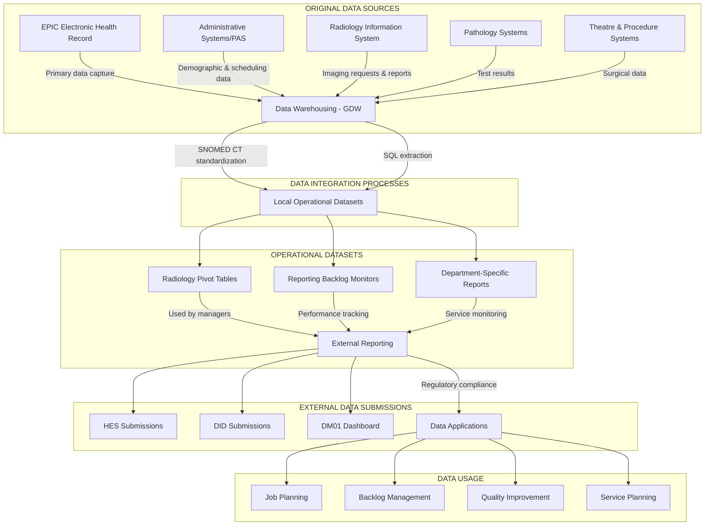

# Analysing and Visualising Operational Data

**Analyse an existing operational data set to determine the original sources of data and present this information in a diagram**

Date Completed: 16/04/2025  
Supervisor: Anil Mistry

Guy's and St Thomas' Trust operates within the broader NHS data ecosystem, where information flows from multiple sources through various systems before ultimately being used for operational management, clinical improvement, and external reporting. Understanding these data flows is essential for effective data governance, research applications, and service improvement initiatives.

## Primary Hospital Data Sources

The hospital's data ecosystem begins with several key clinical and administrative systems that capture patient information at the point of care:

### Clinical Information Systems
At the heart of the Trust's data infrastructure is the EPIC Electronic Health Record system, which I identified as a knowledge gap in my experience. EPIC serves as the primary repository for clinical information, capturing patient data across all hospital departments. Specialty clinical systems (such as those used in ICU and gastroenterology), patient observation systems, and digital imaging systems (PACS/RIS) feed into this central resource.

### Diagnostic Services Data
During my shadowing session with Monika, a CLIMP Information Analyst (17/01/25), I observed how radiology data flows through the system. The Radiology Information System captures diagnostic imaging tests that ultimately contribute to national datasets such as the Diagnostic Imaging Data Set (DID). Monika demonstrated how radiologists and consultants use data extracted from EPIC workbench for job planning and clearing reporting backlogs. This data is presented in pivot tables stored on the Radiology shared drive, showing metrics such as reporting backlogs, examination types, and potential data quality issues.

### Administrative and Operational Systems
The Trust utilizes Patient Administration Systems (PAS), appointment scheduling, and bed management systems to capture non-clinical operational data. These systems generate data that feeds into performance monitoring metrics such as the Diagnostics Waiting Times and Activity Dashboard (DM01), which tracks performance against national standards for waiting times.

## Data Integration and Warehousing

Data from these disparate sources doesn't exist in isolation. The Trust employs a sophisticated data integration approach:

The Business Intelligence team utilizes the hospital's Microsoft SQL Server Management System (SSMS) data warehouse (GDW) to store and process data extracted from source systems. This centralized repository enables comprehensive analysis across clinical services and departments. As Monika explained, this data warehouse is critical for preparing submissions to NHS England and generating the operational reports used by clinical departments.

Data integration involves extraction from source systems, transformation to standardized formats, quality validation, and loading into the warehouse structure. SNOMED CT (Systematized Nomenclature of Medicine Clinical Terms) plays a crucial role in this pipeline, serving as the standard clinical terminology that enables consistent recording and comparison of clinical information. This standardization supports both patient care and subsequent data extraction and exchange.

## Local Datasets and Operational Intelligence

The Trust generates several key local datasets that support operational management and clinical quality monitoring:

### Operational Dashboards
Real-time hospital performance metrics are critical for day-to-day management. During my shadowing experience with Monika, I observed how Radiology-level operational information is extracted from EPIC workbench and utilized across multiple hospitals (KCH, RBH, GSTT). These dashboards track metrics such as reporting backlogs, scan volumes, and departmental performance.

### Clinical Quality Monitoring
The Trust maintains datasets for infection control, patient safety incident recording, clinical outcomes tracking, and mortality and morbidity information. These datasets enable continuous quality improvement and identification of areas requiring intervention.

## External Data Flows and National Submissions

Local hospital data doesn't remain isolated within the Trust. It feeds into national datasets and external reporting systems:

### NHS Data Submissions
The hospital contributes to several national datasets, including Hospital Episode Statistics (HES), which contains details about admissions, outpatient appointments, and historical A&E attendances. The Diagnostic Imaging Data Set (DID) is created from monthly submissions extracted from local radiology information systems. As observed during my shadowing session, the Business Intelligence team is responsible for preparing and submitting this data to NHS England.

### Regulatory Reporting
The Trust must also submit data to regulatory bodies such as the Care Quality Commission (CQC) and participate in national clinical audits. These external data flows ensure compliance with national standards and contribute to healthcare system-wide monitoring.

## Data Usage and Applications

The integrated data ultimately serves multiple purposes within the Trust:

### Operational Management
As witnessed in the Radiology department, data is used for resource allocation, staff scheduling, and performance improvement. Consultants and radiologists utilize reports from EPIC workbench for job planning and managing workloads, particularly for clearing backlogs in areas like neurological scan reporting.

### Clinical Service Improvement
Data analysis drives pathway redesign initiatives, clinical quality improvement projects, and patient flow optimization. The insights derived from integrated datasets help identify bottlenecks, inefficiencies, and opportunities for service enhancement.

### Research and Innovation
The Trust's rich data resources support clinical trials, health services research, and the development of AI and predictive analytics. These research activities often require careful mapping of data flows to ensure appropriate governance, particularly when applying for research approvals under regulations such as COPI Regulations to CAG for section 251.

## Data Flow Diagram: Guy's and St Thomas' Hospital (Radiology)

## Reflection

I've identified several challenges and knowledge gaps that present opportunities for further learning. I lack direct experience with EPIC and would like to understand how Cogito works within this environment. I'm particularly interested in how gastroenterology operational data is analyzed and whether there's a dedicated reporting team I could speak with. Additional areas for exploration include AIDOC Pulmonary Embolism/PERT Retrospective analysis, EPIC Hyperspace/Cogito/Caboodle Access, and further understanding of the GDW (Guy's Data Warehouse) system.

Data quality remains a significant challenge, as highlighted during my shadowing session with Monika. Complications arise when tracking multiple scans for a single patient, which can appear as an inflated backlog when only the first scan has been reported. These data quality issues require careful monitoring and interpretation to ensure accurate operational intelligence.

The hospital data landscape at Guy's and St Thomas' represents a complex ecosystem where information flows from diverse clinical and administrative sources through standardized integration processes into operational datasets and external submissions. Understanding these data pathways is essential for effective service management, quality improvement, and research initiatives.

My shadowing experience with Monika provided valuable insights into how theoretical data flows manifest in practical applications within the Radiology department. The operational data generated from EPIC and other systems directly influences clinical decision-making, resource allocation, and service planning.

As healthcare continues to digitize, mastering these data flows will become increasingly important for healthcare professionals seeking to improve service delivery and patient outcomes through evidence-based decision-making.

## References

* NHS Digital. (2023). Data sets. https://digital.nhs.uk/data-and-information/data-collections-and-data-sets/data-sets

* NHS Data Dictionary. (2023). HODF Data Set. https://www.datadictionary.nhs.uk/data_sets/supporting_data_sets/hodf_data_set.html

* The Health Foundation. (2023). How better use of data can help address key challenges facing the NHS. https://www.health.org.uk/reports-and-analysis/briefings/how-better-use-of-data-can-help-address-key-challenges-facing-the

* The Lancet Digital Health. (2023). Mapping and evaluating national data flows: transparency, privacy, and guiding infrastructural transformation. https://www.sciencedirect.com/science/article/pii/S2589750023001577

* UK Data Service. (2023). Hospital Episode Statistics User Guide. https://doc.ukdataservice.ac.uk/doc/8681/mrdoc/pdf/nextsteps_hes_user_guide_v1.pdf

* NHS Digital. (2023). An introduction to SNOMED. https://digital.nhs.uk/services/terminology-and-classifications/snomed-ct
