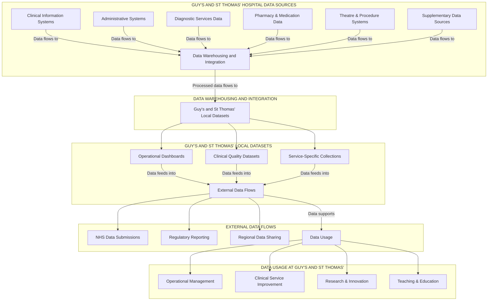

# Guy's and St Thomas' Hospital Data Flow Analysis

## Hospital Data Sources and Operational Flow

### Primary Hospital Data Sources

| Data Source | Description | Examples |
|-------------|-------------|----------|
| **Clinical Information Systems** | Electronic patient record systems used for direct clinical care | • EPIC Electronic Health Record • Specialty clinical systems (e.g., ICU, dialysis) • Patient observations and vital signs systems • Digital imaging systems (PACS/RIS) |
| **Administrative Systems** | Systems managing non-clinical hospital operations | • Patient Administration System (PAS) • Appointment scheduling systems • Patient registration and demographics • Bed management systems |
| **Diagnostic Services Data** | Laboratory and diagnostic test information | • Pathology information systems • Radiology information systems • Specialized diagnostic equipment outputs • Point-of-care testing data |
| **Pharmacy & Medication Data** | Medication prescribing and administration | • Electronic prescribing systems • Medication administration records • Drug stock management • Controlled drug registers |
| **Theatre & Procedure Systems** | Surgical and procedural documentation | • Theatre management systems • Procedure documentation • Anesthesia information systems • Surgical outcome recording |

### Hospital Operational Data Integration

| Process | Description |
|---------|-------------|
| **Data Warehousing & Integration** | • Integration of data from multiple hospital systems • Data cleaning and standardization processes • Creation of linked patient records • Data quality monitoring and improvement |
| **Information Governance Processes** | • Patient consent management • Data protection impact assessments • Access control and audit procedures • Data anonymization/pseudonymization |

### Guy's and St Thomas' Local Datasets

| Dataset Type | Description |
|--------------|-------------|
| **Operational Dashboards** | • Real-time hospital performance metrics • Bed occupancy and patient flow monitoring • Emergency department wait times • Theatre utilization statistics |
| **Clinical Quality Datasets** | • Infection control monitoring • Patient safety incident recording • Clinical outcomes tracking • Mortality and morbidity information |
| **Service-Specific Collections** | • Specialty-specific audit databases • Local clinical registries • Research databases • Quality improvement project data |

### External Data Flows

| Flow Type | Description |
|-----------|-------------|
| **NHS Data Submissions** | • Hospital Episode Statistics (HES) • Emergency Care Dataset (ECDS) • Mental Health Services Dataset (MHSDS) • Diagnostic Imaging Dataset (DIDS) |
| **Regulatory Reporting** | • CQC data submissions • National clinical audit participation • Public health mandatory reporting • Commissioning data requirements |
| **Regional Data Sharing** | • Local Health and Care Record (LHCR) • Integrated Care System (ICS) data sharing • South East London CCG data submissions • Regional clinical network data |

### Supplementary Data Sources

| Source | Description |
|--------|-------------|
| **Primary Care Data** | • GP referral information • Shared care records • Community health service data • Patient pathway tracking |
| **Social Care Integration** | • Discharge planning information • Social care assessment data • Care package information • Multi-agency safeguarding data |
| **Patient-Generated Data** | • Patient-reported outcome measures (PROMs) • Patient experience surveys • Remote monitoring inputs • Patient portal interactions |

### Data Usage at Guy's and St Thomas'

| Usage Area | Applications |
|------------|-------------|
| **Operational Management** | • Capacity planning and resource allocation • Staff scheduling and workforce planning • Financial management and reporting • Operational performance improvement |
| **Clinical Service Improvement** | • Pathway redesign initiatives • Clinical quality improvement projects • Patient flow optimization • Length of stay reduction programs |
| **Research & Innovation** | • Clinical trials participant identification • Health services research • AI and predictive analytics development • Novel intervention evaluation |
| **Teaching & Education** | • Clinical case reviews and teaching • Audit and quality improvement training • Clinical decision support development • Professional development assessment |

## Guy's and St Thomas' Hospital Data Flow Diagram

## Clinical Information Systems Details

- **EPIC Electronic Health Record**: Central repository for patient clinical information
- **Specialty clinical systems**: Specialized systems for specific departments (ICU, dialysis, cardiology)
- **Patient observation systems**: Capture vital signs and nursing observations
- **Digital imaging (PACS/RIS)**: Store and manage radiological images and reports

## Administrative Systems Details

- **Patient Administration System (PAS)**: Core system for patient demographics and encounters
- **Appointment scheduling**: Systems managing outpatient and procedure bookings
- **Patient registration**: Collection of patient demographic information
- **Bed management systems**: Track bed availability and patient placement

## Data Integration Processes

1. **Data extraction**: Regular extraction of data from source systems
2. **Data transformation**: Conversion to standardized formats
3. **Data loading**: Integration into data warehouse structure
4. **Quality validation**: Checks for completeness and accuracy
5. **Master data management**: Maintenance of consistent reference data

## Key Points for Guy's and St Thomas' Hospital Data Analysis

1. **Hospital-Centric Data Collection**: The primary data sources are hospital clinical and administrative systems, with EPIC Electronic Health Record serving as the backbone of clinical data collection.

2. **Integrated Data Approach**: Data from various hospital systems is integrated through the data warehouse, enabling comprehensive analysis across clinical services.

3. **Bi-Directional Data Flow**: While hospital systems generate data for national datasets, these national datasets also provide benchmarking information that flows back to guide hospital operations.

4. **Multi-Purpose Data Usage**: The same source data serves multiple purposes, from direct patient care to operational management, research, and regulatory reporting.

5. **Data Governance Framework**: Robust information governance processes ensure appropriate use of data while protecting patient confidentiality.

6. **Supplementary Data Integration**: Hospital data is enhanced through integration with primary care, social care, and patient-generated information to provide a more complete picture of patient journeys.

7. **Quality Improvement Focus**: Data collection and analysis are aligned with the hospital's commitment to service improvement and excellence in patient care.

## Data Flow Implementation Challenges

- **System interoperability**: Different hospital systems using varying standards and formats
- **Data completeness**: Missing or incomplete data in source systems
- **Timeliness of data**: Delays in data availability for real-time decision-making
- **Skillset requirements**: Specialized expertise needed for complex data analysis
- **Legacy systems**: Older systems with limited integration capabilities

## Future Data Development Opportunities

- **AI and predictive analytics**: Development of predictive models for clinical and operational use
- **Real-time analytics**: Transition from retrospective to real-time data analysis
- **Enhanced data visualization**: More sophisticated dashboards and visual analytics
- **Patient-centered data integration**: Greater incorporation of patient-reported data
- **Cross-organizational data sharing**: Enhanced data exchange with other regional providers
